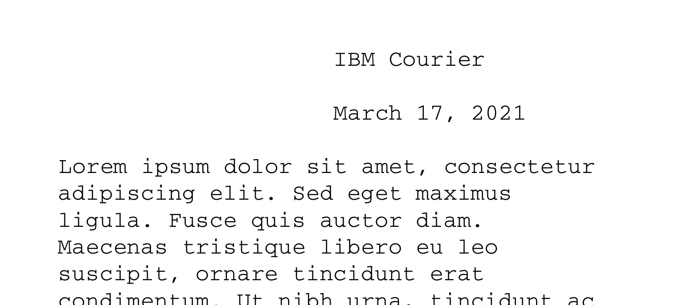
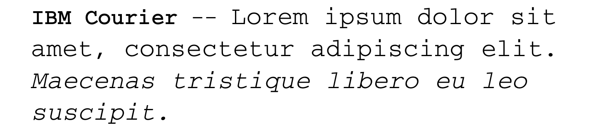
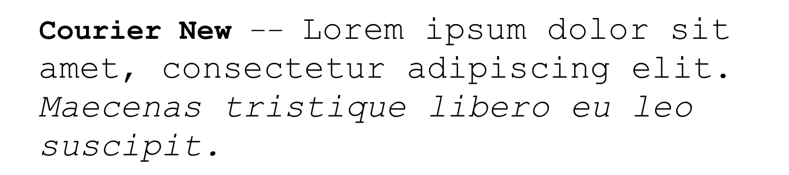
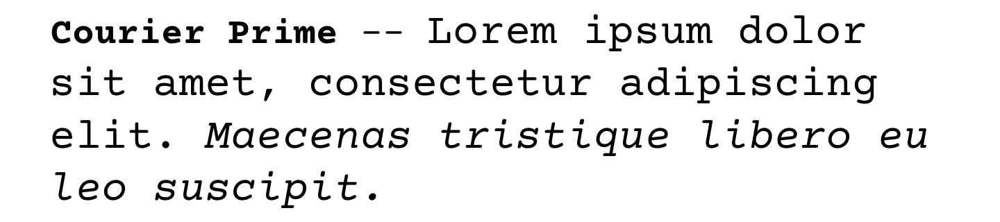
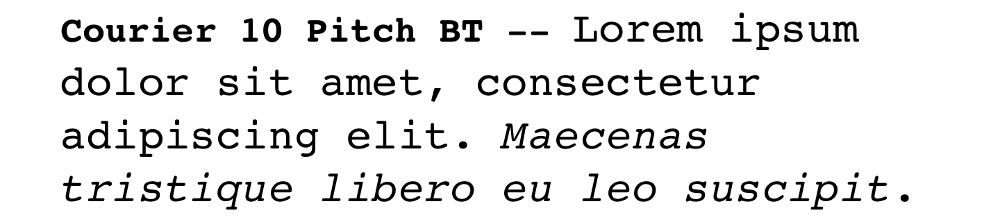
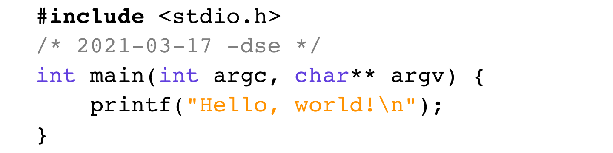

# IBM Courier

IBM made this digital implementation of its commissioned typeface,
Courier, available as a PostScript Type 1 font under the [IBM/MIT X
Consortium Courier Typefont agreement](COPYRIGHT), a permissive
license.

This distribution of IBM Courier retains the original copyright, and
includes along with the original fonts, conversions of them to these
modern formats:

-   OpenType
-   TrueType
-   WOFF and WOFF2
-   SVG

IBM Courier is available in four weights:

-   Regular
-   Italic
-   Bold
-   Bold Italic

A [CSS file](fonts/IBM-Courier.css) for use on web sites is also
included.

I have not altered the fonts in any way, with the exception of any
changes FontForge may have made in the process of converting them.

## Compared with Other Couriers

IBM Courier is slightly thicker than [Courier
New](https://www.myfonts.com/fonts/mti/courier-new/); but not as thick
as, say, [Courier Prime](https://quoteunquoteapps.com/courierprime/)
or Bitstream's [Courier 10 Pitch
BT](https://www.myfonts.com/fonts/bitstream/courier-10-pitch/).

Stroke terminators are flat, not round.

-   **IBM Courier**, used in business correspondence for decades:

    

-   **Courier New**, used on computer screens for decades:

    

-   **Courier Prime**, purpose-built for screenplays:

    
    
    Note the flat-round strokes and the *actual* italic!

-   **Courier 10 Pitch BT**, courtesy Bitstream:

    

-   [**Courier Code**](https://fontlibrary.org/en/font/courier-code),
    same as Courier 10 Pitch BT with minor modifications:

    
    
    Note the lowercase ell (`l`) and the digits one (`1`) and zero (`0`).

## About (IBM) Courier

[Yeah, just read the Wikipedia.](https://en.wikipedia.org/wiki/Courier_%28typeface%29)

Courier is not a registered trademark, though IBM is.  I'm only using
the IBM name because it's... IBM's product.
